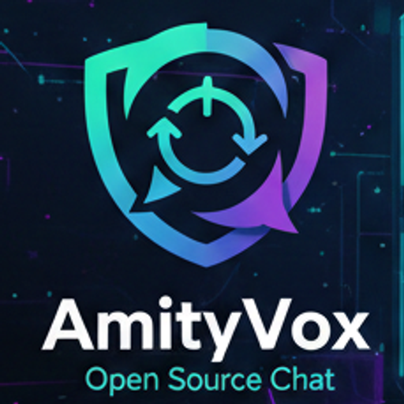

<!-- markdownlint-disable MD041 -->
<p align="center">
  
</p>

<h1 align="center">AmityVox</h1>

<p align="center">
  A self-hosted, federated, optionally-encrypted communication platform.<br>
  Think Discord, but open source, federated, and designed to run on a Raspberry Pi.
</p>

<p align="center">
  <a href="LICENSE">AGPL-3.0</a> &middot;
  <a href="https://discord.gg/VvxgUpF3uQ">Discord</a> &middot;
  <a href="https://app.amityvox.chat/">Live Instance</a> &middot;
  <a href="https://github.com/WAN-Ninjas/AmityVox/issues">Issues</a>
</p>

---

## About

AmityVox is a self-hosted communication platform for communities that want a turnkey alternative to Discord. It combines guilds, channels, DMs, voice/video, moderation tools, federation, and optional end-to-end encryption in one AGPL-3.0 project.

## Features

- Guilds, channels, DMs, threads, replies, reactions, pins, rich markdown, polls, bookmarks, custom emoji, stickers, and GIF search.
- Voice/video channels with screen sharing through LiveKit, plus full-text search through Meilisearch.
- Admin dashboard, audit logs, AutoMod, reports, user management, and CLI tools.
- Optional MLS end-to-end encryption, TOTP/WebAuthn 2FA, Argon2id password hashing, and EXIF metadata stripping.
- Federation modes for public, open, closed, or standalone instances.
- Responsive PWA with push notifications; native apps are planned through Tauri.

## Architecture

AmityVox runs as a set of Docker containers orchestrated by Docker Compose:

| Service | Image | Purpose |
|---|---|---|
| **amityvox** | Custom (Go binary) | REST API, WebSocket gateway, background workers |
| **postgresql** | `postgres:16-alpine` | Primary database (source of truth) |
| **nats** | `nats:2-alpine` | Real-time event bus (JetStream) |
| **dragonflydb** | `dragonflydb/dragonfly` | Cache and session store (Redis-compatible) |
| **garage** | `dxflrs/garage:v1.0.1` | S3-compatible file storage |
| **livekit** | `livekit/livekit-server` | Voice/video WebRTC SFU |
| **meilisearch** | `getmeili/meilisearch:v1.35` | Full-text search engine |
| **libretranslate** | `libretranslate/libretranslate` | Self-hosted translation API |
| **caddy** | `caddy:2-alpine` | Reverse proxy with automatic TLS (Let's Encrypt) |

Total footprint: ~700 MB to 1.2 GB RAM. Runs comfortably on a Raspberry Pi 5 (8 GB).

## Versioning

The current application version is `0.5.0`. The root `VERSION` file is the canonical release version and must stay aligned with `web/package.json` and `web/package-lock.json`. Build metadata is attached as `version+commit.sanitizedBuildDate` and is exposed by the CLI, health/client-config responses, and gateway HELLO metadata. See `docs/versioning.md`.

## Install

### Requirements

- [Docker Engine](https://docs.docker.com/engine/install/) 24+ with Docker Compose v2
- A domain name pointed at your server (for TLS) — or `localhost` for local testing
- 2 GB+ RAM (4 GB recommended)
- Ports 80 and 443 open (Caddy handles TLS automatically)

### Interactive Setup

Recommended for most installs. The script clones the repo, writes configuration, initializes S3 storage, creates the first admin user, and starts the stack:

```bash
curl -fsSL https://raw.githubusercontent.com/WAN-Ninjas/AmityVox/main/install.sh | bash
```

### Manual Deploy

Use this when you want to inspect or edit configuration before first boot:

```bash
git clone https://github.com/WAN-Ninjas/AmityVox.git amityvox
cd amityvox
cp .env.example .env
# Edit .env before starting.
docker compose --env-file .env -f deploy/docker/docker-compose.yml up -d --build
```

For prebuilt-image deployments without a full clone:

```bash
mkdir amityvox && cd amityvox
curl -O https://raw.githubusercontent.com/WAN-Ninjas/AmityVox/main/docker_deploy/docker-compose.yml
curl -O https://raw.githubusercontent.com/WAN-Ninjas/AmityVox/main/docker_deploy/.env.example
cp .env.example .env
# Edit .env before starting.
docker compose up -d
```

Manual installs must complete the post-install steps below.

## Post-Install Setup

If you used the interactive setup, these steps were done for you automatically. For manual installs, complete the following:

### 1. Set Up S3 Storage (Garage)

Garage needs a one-time bootstrap after first boot:

```bash
# Get the node ID
NODE_ID=$(docker exec amityvox-garage /garage status 2>&1 | grep -oP '[a-f0-9]{64}' | head -1)

# Assign storage capacity and apply layout
docker exec amityvox-garage /garage layout assign -z dc1 -c 1G "$NODE_ID"
docker exec amityvox-garage /garage layout apply --version 1

# Create bucket and access key
docker exec amityvox-garage /garage bucket create amityvox
docker exec amityvox-garage /garage key create amityvox-key

# Grant the key read/write access to the bucket
docker exec amityvox-garage /garage bucket allow amityvox --read --write --key amityvox-key

# Show the key credentials — copy these into your .env
docker exec amityvox-garage /garage key info amityvox-key
```

Copy the **Key ID** and **Secret key** from the output into your `.env` file as `AMITYVOX_STORAGE_ACCESS_KEY` and `AMITYVOX_STORAGE_SECRET_KEY`, then restart:

```bash
docker compose restart amityvox
```

### 2. Create an Admin Account

```bash
docker exec amityvox amityvox admin create-user <username> <email> <password>
docker exec amityvox amityvox admin set-admin <username>
```

### 3. Log In

Open your domain (or `http://localhost`) in a browser, log in with your admin account, and start using AmityVox.

## Operations

Set `APP_DIR` to your install directory. The interactive installer usually uses `/home/user/amityvox`:

```bash
export APP_DIR=/home/user/amityvox
```

| Task | Command |
|---|---|
| View logs | `cd "$APP_DIR" && docker compose --env-file .env -f deploy/docker/docker-compose.yml logs -f` |
| Stop | `cd "$APP_DIR" && docker compose --env-file .env -f deploy/docker/docker-compose.yml down` |
| Start | `cd "$APP_DIR" && docker compose --env-file .env -f deploy/docker/docker-compose.yml up -d` |
| Update | `cd "$APP_DIR" && ./update.sh` |
| Backup | `cd "$APP_DIR" && ./scripts/backup.sh` |
| Create user | `docker exec amityvox amityvox admin create-user <user> <email> <pass>` |

`down` stops containers but keeps Docker volumes unless you add `-v`.

## Configuration

All runtime settings are controlled via environment variables in `.env`. The key variables:

| Variable | Default | Description |
|---|---|---|
| `AMITYVOX_INSTANCE_DOMAIN` | `localhost` | Your public domain (TLS, WebAuthn, federation) |
| `AMITYVOX_INSTANCE_NAME` | `AmityVox` | Display name in the UI |
| `POSTGRES_PASSWORD` | `amityvox` | Database password — **change this** |
| `LIVEKIT_API_KEY` | `devkey` | LiveKit auth key — **change this** |
| `LIVEKIT_API_SECRET` | `secret` | LiveKit auth secret — **change this** |
| `MEILI_MASTER_KEY` | *(empty)* | Meilisearch API key — **set for production** |
| `AMITYVOX_STORAGE_ACCESS_KEY` | *(empty)* | S3 access key (from Garage setup) |
| `AMITYVOX_STORAGE_SECRET_KEY` | *(empty)* | S3 secret key (from Garage setup) |
| `AMITYVOX_GIPHY_ENABLED` | `false` | Enable GIF search ([get a key](https://developers.giphy.com/dashboard/)) |
| `AMITYVOX_GIPHY_API_KEY` | *(empty)* | Giphy API key |
| `AMITYVOX_AUTH_REGISTRATION_ENABLED` | `true` | Allow new user registration |
| `AMITYVOX_AUTH_INVITE_ONLY` | `false` | Require invite code to register |
| `AMITYVOX_MEDIA_MAX_UPLOAD_SIZE` | `50MB` | Maximum file upload size |

See [`.env.example`](.env.example) for the complete list including push notifications, translation, logging, and metrics settings.

### TLS / Custom Domain

Set `AMITYVOX_INSTANCE_DOMAIN` to your domain in `.env`. Caddy automatically provisions Let's Encrypt TLS certificates — just make sure ports 80 and 443 are open and the domain's DNS points to your server.

For local testing, leave it as `localhost` — Caddy will serve over HTTP.

### Push Notifications

To enable browser push notifications, generate VAPID keys and add them to `.env`:

```bash
npx web-push generate-vapid-keys
```

Set `AMITYVOX_PUSH_VAPID_PUBLIC_KEY`, `AMITYVOX_PUSH_VAPID_PRIVATE_KEY`, and `AMITYVOX_PUSH_VAPID_CONTACT_EMAIL` in your `.env`.

## CLI Reference

All CLI commands run inside the `amityvox` container:

```bash
docker exec amityvox amityvox <command>
```

| Command | Description |
|---|---|
| `admin create-user <user> <email> <pass>` | Create a new user account |
| `admin set-admin <user>` | Grant admin privileges |
| `admin unset-admin <user>` | Revoke admin privileges |
| `admin suspend <user>` | Suspend a user account |
| `admin unsuspend <user>` | Unsuspend a user account |
| `admin list-users` | List all user accounts |
| `migrate up` | Run pending database migrations |
| `migrate down` | Rollback the last migration |
| `migrate status` | Show current migration status |
| `version` | Print version and build info |

## Backup & Restore

### Backup

```bash
./scripts/backup.sh                  # Saves to ./backups/
./scripts/backup.sh /path/to/dir     # Saves to custom directory
```

Creates a timestamped `.tar.gz` containing a full PostgreSQL dump and your configuration files.

### Restore

```bash
./scripts/restore.sh ./backups/amityvox_20260220_120000.tar.gz
```

Restores the database and optionally your configuration. **This overwrites the current database** — you will be prompted to confirm.

### Manual Backup

```bash
docker exec amityvox-postgresql pg_dumpall -U amityvox > backup.sql
```

### Manual Restore

```bash
cat backup.sql | docker exec -i amityvox-postgresql psql -U amityvox
```

## Updating

```bash
cd ~/amityvox
./update.sh
```

The update script preserves `.env` and Docker volumes, creates a pre-update backup under `./backups/`, pulls with fast-forward only, rebuilds `amityvox` and `web-init`, runs `docker compose up -d`, and restarts Caddy. Database migrations run automatically on startup.

For remote/scripted updates:

```bash
curl -fsSL https://raw.githubusercontent.com/WAN-Ninjas/AmityVox/main/update.sh | bash
```

Useful update flags:

```bash
AMITYVOX_SKIP_BACKUP=1 ./update.sh       # skip pre-update backup
AMITYVOX_NO_CACHE=1 ./update.sh          # rebuild without Docker cache
AMITYVOX_BRANCH=main ./update.sh         # update from a specific branch
```

For prebuilt image deployments:

```bash
docker compose pull
docker compose up -d
```

## Encryption

AmityVox supports optional end-to-end encryption using MLS (RFC 9420). This is **not** a privacy-first platform like Matrix — it's an optional feature for channels and DMs that need it.

- The party initiating encryption generates a key client-side that is **never** sent to the server
- If the key or passphrase is lost, there is no recovery mechanism
- Without the key, instance owners (assuming unmodified code) cannot decrypt stored messages or media
- Users joining an encrypted channel receive the key out-of-band

## Federation

AmityVox supports four federation modes:

| Mode | Description |
|---|---|
| **Public** | Listed on the master federation server. Anyone can find and federate with you. |
| **Open** | Not listed, but anyone who knows your domain can federate with you. |
| **Closed** | Requires exchanging keys and whitelisting on both sides. |
| **Disabled** | Completely standalone, no federation. |

When federated, users can join guilds on other instances, DM across instances, and voice/video call across instances (requires LiveKit on all sides).

## Development

AmityVox is built with:

- **Backend:** Go 1.26, chi router, pgx (PostgreSQL), NATS, slog
- **Frontend:** SvelteKit 2, Svelte 5, Tailwind CSS 4, TypeScript 5.9
- **Build:** 3-stage Docker (Node 24 LTS, Go 1.26, Alpine 3.21)

All development happens inside Docker. See [docs/architecture.md](docs/architecture.md) for the full developer guide.

```bash
make docker-up              # Start all services
make docker-down            # Stop all services
make docker-restart         # Rebuild and restart
make docker-test-frontend   # Run frontend tests in Docker
make docker-test            # Run all tests (Go + frontend)
make docker-logs            # Follow all service logs
```

## Community

- **[Live Instance](https://app.amityvox.chat/)** — Try AmityVox without installing. Come chat with us — I'm @Horatio.
- **[Discord](https://discord.gg/VvxgUpF3uQ)** — Support, feedback, and announcements
- **[GitHub Issues](https://github.com/WAN-Ninjas/AmityVox/issues)** — Bug reports and feature requests
- **In-App** — Use the Report Issue button on [amityvox.chat](https://amityvox.chat/) to file bugs directly

## License

[GNU Affero General Public License v3.0](LICENSE)
